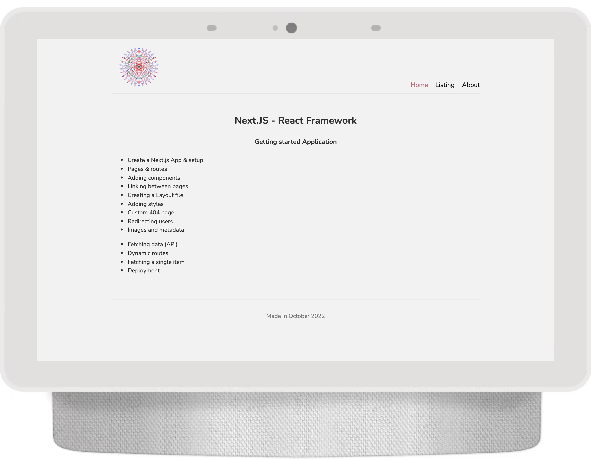
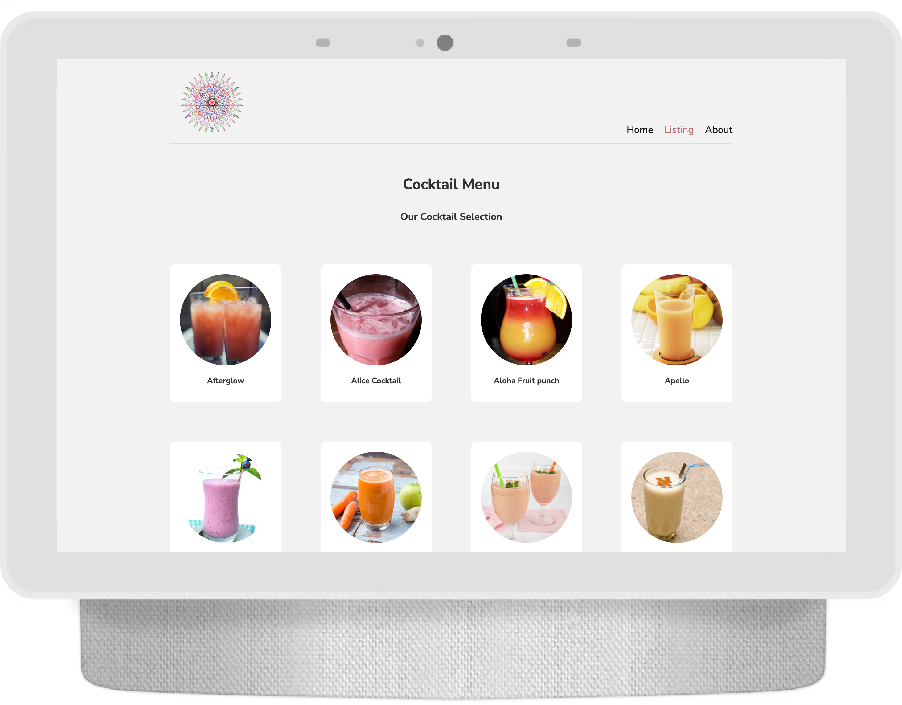
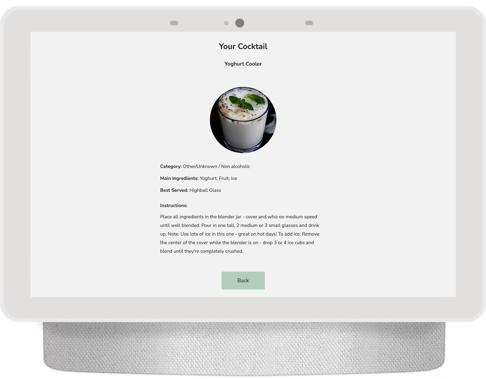

# Deployed on Vercel at: https://next-js-cocktailbar.vercel.app/

This is a [Next.js](https://nextjs.org/) project bootstrapped with [`create-next-app`](https://github.com/vercel/next.js/tree/canary/packages/create-next-app).

## Getting Started

 <h1>Next.JS - React Framework</h1>
 <h2>The Cocktail Bar</h2>

           - Create a Next.js App & setup
           - Pages & routes
           - Adding components
           - Linking between pages
           - Creating a Layout file
           - Adding styles
           - Custom 404 page
           - Redirecting users
           - Images and metadata

           - Fetching data (API)
           -  Dynamic routes
           -  Fetching a single item
           -  Deployment
